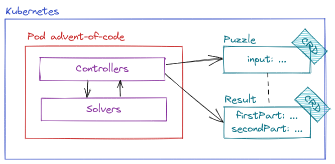

# Advent of Code Kubernetes Operator

Why not?

Using [Bonny](https://github.com/coryodaniel/bonny) (framework used to build an Elixir Kubernetes operator).

This operator adds two CRDs, `Puzzle` and `Result`.
The logic is that new `Puzzle` resources will be solved by the operator that creates a `Result` resource in response, with the results.



## Custom resources

### `Puzzle`

```yaml
apiVersion: advent-of-code.wttj.co/v1alpha1
kind: Puzzle
metadata:
  name: pauldn-day01-y2022
  namespace: advent-of-code
spec:
  day: 1
  year: 2022
  input: |
    123
    456
    789
```

### `Result`

```yaml
apiVersion: advent-of-code.wttj.co/v1alpha1
kind: Result
metadata:
  name: pauldn-day01-y2022
  namespace: advent-of-code
spec:
  day: 1
  year: 2022
  firstPart: 123
  secondPart: 456
```

## TODO

- [X] Add Dockerfile
- [X] Add Helm chart
- [ ] Add different config files for test / dev / prod
- [ ] Clean up hard-coded `:dev` / `:prod` environment used in `AdventOfCode.Application`
- [ ] Check that `WATCH_NAMESPACES` variable is used properly
- [ ] Improve Helm chart (helpers and variabilize things that should be variabilized)
- [ ] Add reconciliation logic if `Result` resource is removed
- [ ] Mark `Puzzle` as solved in status when solved
- [ ] Add events to `Puzzle` when error occurs
- [ ] Change `Result` `solved` attribute as `solvedAt`
- [ ] Add support for other years
- [ ] Add integration tests

## Workarounds

- I had to use the same image for both build and run images, otherwise I can't run my release due to the following error (even though `erlexec` does exist)

```
/app/releases/0.1.0/../../erts-13.1.2/bin/erl: exec: line 12: /app/erts-13.1.2/bin/erlexec: not found
```

- I had to add `operator_name` and `group` parameters to the `bonny.exs` config, otherwise Bonny tries to call Mix to get these parameters.

## FAQ

- Why?

Because I wanted to learn Elixir this year and I like Kubernetes.
Also, Advent of Code is cool because elves and Santa.

- How can I run it?

TODO

- Is this a 

- Is this production-ready?

Yes, Advent Of Code Kubernetes Operator® is the most advanced Kubernetes tool that you can use if your business involves regularly solving Advent of Code puzzles.
